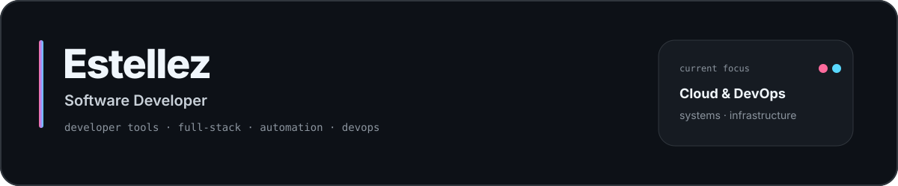
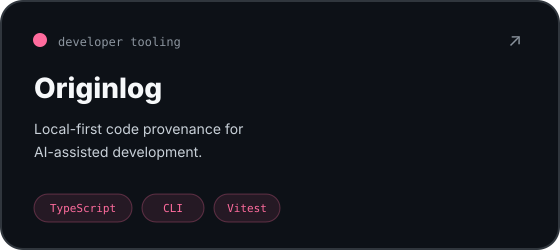
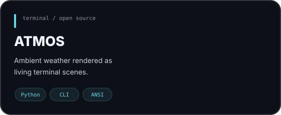
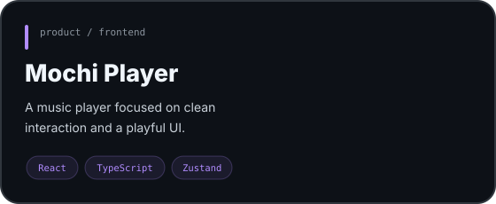
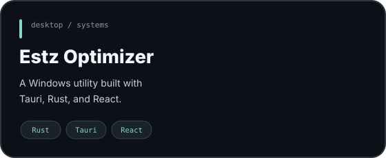
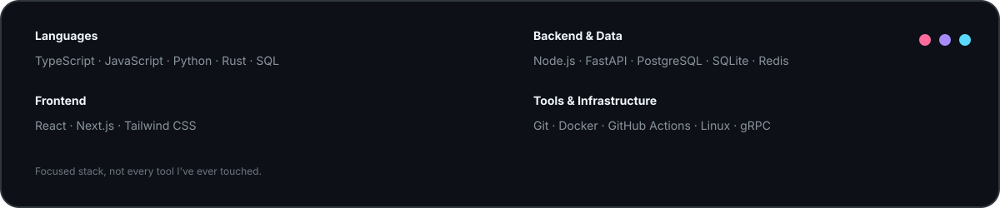

 

 

## 01 / Selected work

  
  

  
  

 

## 02 / Stack

<table>
<tr>
<td width="44%" valign="top">

### Most used languages

  

</td>
<td width="56%" valign="top">

### What I work with

</td>
</tr>
</table>

 

## 03 / Current focus

<table>
<tr>
<td width="33%" align="center" valign="top">

### Build
Developer tools  
Open-source projects

</td>
<td width="33%" align="center" valign="top">

### Learn
Cloud infrastructure  
DevOps

</td>
<td width="33%" align="center" valign="top">

### Explore
Systems  
Networking · Automation

</td>
</tr>
</table>

 

## 04 / About

I’m **Estellez**, a Computer Science student and software developer from Thailand.

I started with web development and gradually moved toward **full-stack applications, developer tooling, automation, and systems-oriented projects**.

I like software that is practical, visually clean, and interesting to build.

 

<b>estz / estellez</b>

